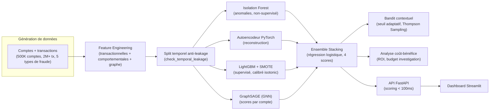

# Détection de Fraude en Temps Réel -- PayLink Africa

[](https://github.com/Jean-Paul15/fraud-detection-paylink-africa/actions/workflows/tests.yml)
[](LICENSE)
[](requirements.txt)
[](requirements.txt)

> Système de détection de fraude multi-modèles pour une fintech panafricaine opérant dans l'UEMOA. Pipeline end-to-end combinant Isolation Forest, Autoencodeur, LightGBM, GraphSAGE et Stacking pour maximiser la détection tout en minimisant les faux positifs.

## Architecture



Chaque modèle capture un signal différent : anomalies statistiques (IF), patterns non
linéaires (AE), patterns supervisés (LGB), structure relationnelle du réseau de
comptes (GNN). Le stacking apprend leur pondération optimale plutôt que de figer un
vote arbitraire.

## Résumé exécutif

| Critère | Valeur |
|---------|--------|
| **Modèle retenu** | Ensemble Stacking (IF + AE + LightGBM) |
| **AUC-ROC** | **0.878** |
| **AUC-PR** | **0.066** (x43 vs baseline 0.0015) |
| **Lift @ 1%** | **33.2x** |
| **Lift @ 5%** | **10.2x** |
| **Recall @ FPR=1%** | 33.6% |
| **ROI opérationnel** | **0.65x** |
| **Économies projetées** | **77M FCFA** / an |
| **Latence inférence** | < 100ms (cible) |
| **CV AUC-PR (LightGBM)** | 0.9934 +/- 0.008 |
| **Features** | 50 (transactionnelles + comportementales + graphe) |
| **Échantillon train** | 500 000 transactions |
| **Échantillon test** | 501 458 transactions |
| **Taux fraude train** | 0.44% (sur-échantillonné) |
| **Taux fraude test** | 0.15% (distribution réelle) |

## Pourquoi ces métriques ?

Avec un taux de fraude de seulement **0.15%**, les métriques classiques (accuracy, F1-score) sont trompeuses :

- Un modèle naïf prédisant toujours "légitime" aurait **99.85% d'accuracy** mais détecterait **zéro fraude**
- **L'AUC-PR** (Precision-Recall) est la métrique de référence pour les classes très rares
- **Le Lift** mesure le facteur multiplicatif de fraude dans les top K% des scores vs la moyenne
- **Le ROI** intègre les coûts opérationnels (investigation faux positifs = 5 000 FCFA, fraude manquée = 500 000 FCFA)

Note : l'AUC-PR de 0.066 peut sembler faible, mais elle est **43x supérieure au taux de fraude aléatoire** (0.0015). La CV AUC-PR de 0.993 est obtenue après SMOTE sur le jeu d'entraînement et reflète la performance sur données rééquilibrées.

## Approche méthodologique

Le projet suit une démarche adaptée à la détection de fraude en conditions réelles :

```
1. Génération de données réalistes
   --> Comptes (500K), transactions (2M+), graphe, 5 types de fraude

2. EDA (Analyse Exploratoire)
   --> Déséquilibre extrême (0.15%), patterns temporels, canaux à risque

3. Feature Engineering (4 familles)
   --> Transactionnelles + Comportementales (fenêtres 1h/6h/24h) + Graphe + Base

4. Feature Selection
   --> VarianceThreshold + Anti-corrélation (0.95) + Top 50 LGB importance

5. Preprocessing comparatif
   --> StandardScaler vs RobustScaler --> StandardScaler retenu

6. Modélisation (3 modèles complémentaires)
   --> Isolation Forest (anomalies non-supervisé, contamination adaptative)
   --> Autoencodeur (reconstruction deep learning, entraîné sur légitimes)
   --> LightGBM (supervisé avec SMOTE, class_weight='balanced')

7. Ensemble Stacking
   --> Régression Logistique comme méta-modèle sur les 3 scores

8. Évaluation coût-bénéfice
   --> Seuil optimal, budget investigation, ROI par modèle

9. API FastAPI + Dashboard Streamlit
   --> Scoring temps réel (<100ms), monitoring visuel
```

## Architecture du projet

```
fraud_detection_project/
|
|-- README.md                               # Documentation
|-- requirements.txt                        # Dépendances
|-- Dockerfile                              # Image Docker
|-- docker-compose.yml                      # Orchestration API + Dashboard
|-- metadata.json                           # Métriques finales
|-- inference.py                            # Script d'inférence production
|-- master_pipeline.py                      # Pipeline complet (EDA --> Sauvegarde)
|-- .gitignore
|
|-- data/
|   |-- raw/
|   |   |-- transactions.csv                # 2M+ transactions
|   |   `-- accounts.csv                    # 500K comptes
|   |-- processed/
|   |   |-- train.csv                       # Split entraînement
|   |   `-- test.csv                        # Split test
|   `-- graph/
|       |-- nodes.csv                       # Nœuds du graphe de transactions
|       `-- edges.csv                       # Liens du graphe
|
|-- src/
|   |-- config.py                           # Configuration globale
|   |-- data/                               # Génération de données synthétiques
|   |   |-- generate_fraud_data.py
|   |   |-- accounts.py, transactions.py, features.py, utils.py
|   |-- features/                           # Feature engineering
|   |   |-- transactional.py                # Features par transaction
|   |   |-- behavioral.py                   # Features comportementales (fenêtres)
|   |   `-- graph_features.py               # Features de graphe
|   |-- preprocessing/
|   |   |-- split.py                        # Split temporel + validation fuite
|   |   `-- pipeline.py                     # Pipeline preprocessing
|   |-- models/
|   |   |-- isolation_forest.py             # Modèle 1 : Isolation Forest
|   |   |-- autoencoder.py                  # Modèle 2 : Autoencodeur PyTorch
|   |   |-- ensemble.py                     # Modèle 4 : Stacking
|   |   `-- gnn.py                          # Modèle 5 : Graph Neural Network
|   `-- evaluation/
|       `-- fraud_metrics.py                # Métriques fraude + coût-bénéfice
|
|-- api/
|   `-- main.py                             # API FastAPI (scoring temps réel)
|
|-- dashboard/
|   `-- app.py                              # Dashboard Streamlit
|
|-- notebooks/
|   |-- 01_EDA_Fraude.ipynb                 # Analyse exploratoire complète
|   `-- 02_Modelisation_Fraude.ipynb        # Modélisation et évaluation
|
|-- outputs/
|   |-- models/
|   |   |-- ensemble_stacking.pkl           # Modèle final (méta-modèle LogReg)
|   |   |-- lightgbm.pkl                    # LightGBM supervisé
|   |   |-- isolation_forest.pkl            # Isolation Forest
|   |   |-- autoencoder.pt                  # Autoencodeur PyTorch
|   |   |-- gnn_graphsage.pt                # GraphSAGE (GNN, si torch_geometric dispo)
|   |   |-- gnn_account_scores.pkl          # Scores GNN par compte (4e entree du stacking)
|   |   |-- scaler.pkl                      # StandardScaler
|   |   |-- feature_columns.pkl             # Top 50 features
|   |   |-- bandit.pkl                      # Bandit contextuel (seuil adaptatif)
|   |   `-- results.json                    # Métriques comparatives
|   `-- figures/                            # Graphiques générés
|
`-- tests/                                  # Tests unitaires
```

## Performances détaillées

| Modèle | AUC-ROC | AUC-PR | Recall@FPR=1% | Lift@1% | Lift@5% |
|--------|---------|--------|---------------|---------|---------|
| Isolation Forest | 0.599 | 0.003 | 4.2% | 4.2x | 3.0x |
| Autoencodeur | 0.655 | 0.006 | 13.8% | 13.9x | 4.6x |
| LightGBM | **0.882** | 0.062 | 33.3% | 33.0x | 10.1x |
| **Stacking** | 0.878 | **0.066** | **33.6%** | **33.2x** | **10.2x** |

### Analyse coût-bénéfice

| Paramètre | Valeur |
|-----------|--------|
| Coût faux positif (investigation) | 5 000 FCFA |
| Coût faux négatif (fraude manquée) | 500 000 FCFA |
| Modèle avec meilleur ROI | Stacking (0.65x) |
| Économies annuelles estimées | 77M FCFA |
| Budget investigation mensuel | 1 000 000 FCFA |

## Top 10 Features

| Rang | Feature | Famille |
|------|---------|---------|
| 1 | `sender_tx_count_cumulative` | Comportementale |
| 2 | `sender_account_age_log` | Base |
| 3 | `receiver_g_total_received` | Graphe |
| 4 | `sender_g_total_sent` | Graphe |
| 5 | `sender_g_total_received` | Graphe |
| 6 | `day_of_month` | Temporelle |
| 7 | `receiver_g_flow_ratio` | Graphe |
| 8 | `sender_g_flow_ratio` | Graphe |
| 9 | `time_since_last_tx_sec` | Comportementale |
| 10 | `receiver_g_in_degree` | Graphe |

## Installation

```bash
# Cloner le dépôt
git clone <repo-url>
cd "Projet 2 - Detection de Fraude en Temps Reel"

# Créer l'environnement virtuel
python -m venv venv
# Windows :
venv\Scripts\activate
# Linux/Mac :
source venv/bin/activate

# Installer les dépendances
pip install -r requirements.txt
```

## Utilisation

### Génération des données

```bash
python src/data/generate_fraud_data.py
```

### Pipeline complet (EDA --> Sauvegarde des modèles)

```bash
python master_pipeline.py
```

### Inférence en production

```python
from inference import FraudDetector

detector = FraudDetector()

# Scoring d'une transaction
transaction = {
    'transaction_id': 'TX-123456',
    'timestamp': '2024-01-15T14:30:00',
    'amount': 150000,
    'sender_id': 'ACC-001',
    'receiver_id': 'ACC-002',
    'transaction_type': 'transfer',
    'channel': 'mobile_app',
    'sender_account_age': 180,
    'sender_kyc': 2,
    # Autres features automatiquement complétées si absentes
}
score = detector.predict(transaction)
print(f"Score de fraude: {score:.4f}")

# Scoring par lot
transactions = [tx1, tx2, tx3, ...]
scores = detector.predict_batch(transactions)

# Explication d'une transaction
explanation = detector.explain(transaction)
print(explanation)

# Rapport complet (score + risque + explication)
report = detector.predict_full(transaction)
```

### API (FastAPI)

```bash
uvicorn api.main:app --host 0.0.0.0 --port 8001
```

Endpoints :
- `GET /health` -- État de l'API
- `POST /score` -- Score une transaction
- `POST /score/batch` -- Score un lot (max 1000)

### Dashboard (Streamlit)

```bash
streamlit run dashboard/app.py --server.port 8501
```

### Docker Compose (API + Dashboard)

```bash
docker-compose up --build
```

- API : http://localhost:8001/docs
- Dashboard : http://localhost:8501

## Choix techniques

### Pourquoi un Ensemble Stacking ?

Chaque modèle capture un aspect différent de la fraude :
- **Isolation Forest** : anomalies statistiques (non-supervisé, détecte les nouvelles fraudes)
- **Autoencodeur** : erreur de reconstruction (deep learning, patterns non-linéaires)
- **LightGBM** : patterns supervisés (gradient boosting sur features structurées)

Le stacking combine ces 3 perspectives via une régression logistique qui apprend leurs poids optimaux.

### Pourquoi AUC-PR et pas AUC-ROC ?

Avec 0.15% de fraude, l'AUC-ROC est trompeuse car dominée par les vrais négatifs. L'AUC-PR se concentre sur la classe minoritaire (fraude) et est la métrique recommandée pour les datasets hautement déséquilibrés.

### Pourquoi SMOTE ?

SMOTE génère des échantillons synthétiques de la classe fraude pour rééquilibrer l'entraînement du LightGBM. Combiné avec `class_weight='balanced'`, cela permet au modèle d'apprendre les patterns de fraude sans être écrasé par la classe majoritaire.

## Références

- Dal Pozzolo, A. et al. (2015) -- *Calibrating Probability with Undersampling for Unbalanced Classification* (IEEE CIFEr)
- Liu, F. T. et al. (2008) -- *Isolation Forest* (IEEE ICDM)
- Chen, T. & Guestrin, C. (2016) -- *XGBoost: A Scalable Tree Boosting System* (KDD)
- Ke, G. et al. (2017) -- *LightGBM: A Highly Efficient Gradient Boosting Decision Tree* (NIPS)
- BCEAO Instruction n.001-01-2024 -- Services de paiement UMOA
- Snoek, J. et al. (2012) -- *Practical Bayesian Optimization of Machine Learning Algorithms* (NIPS)
- Lundberg, S. & Lee, S.I. (2017) -- *SHAP: A Unified Approach to Interpreting Model Predictions*

---

**Auteur :** Jean-Paul ADOGLI
**Version :** 1.0 (mai 2026)
**Domaine :** Détection de Fraude -- Fintech / UEMOA
**Modèles :** Isolation Forest + Autoencodeur (PyTorch) + LightGBM + GraphSAGE (GNN) + Stacking (LogReg)
